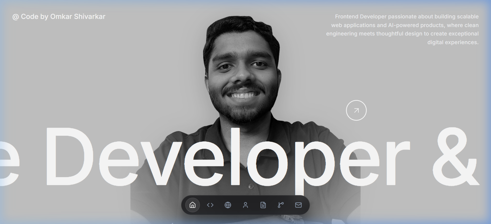
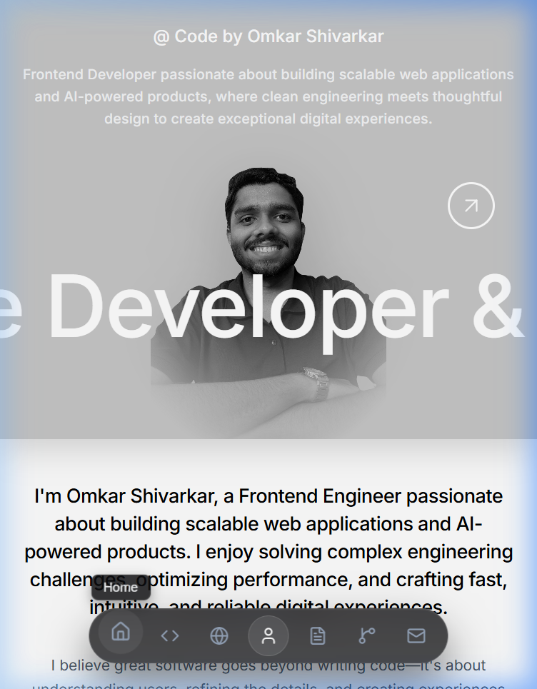
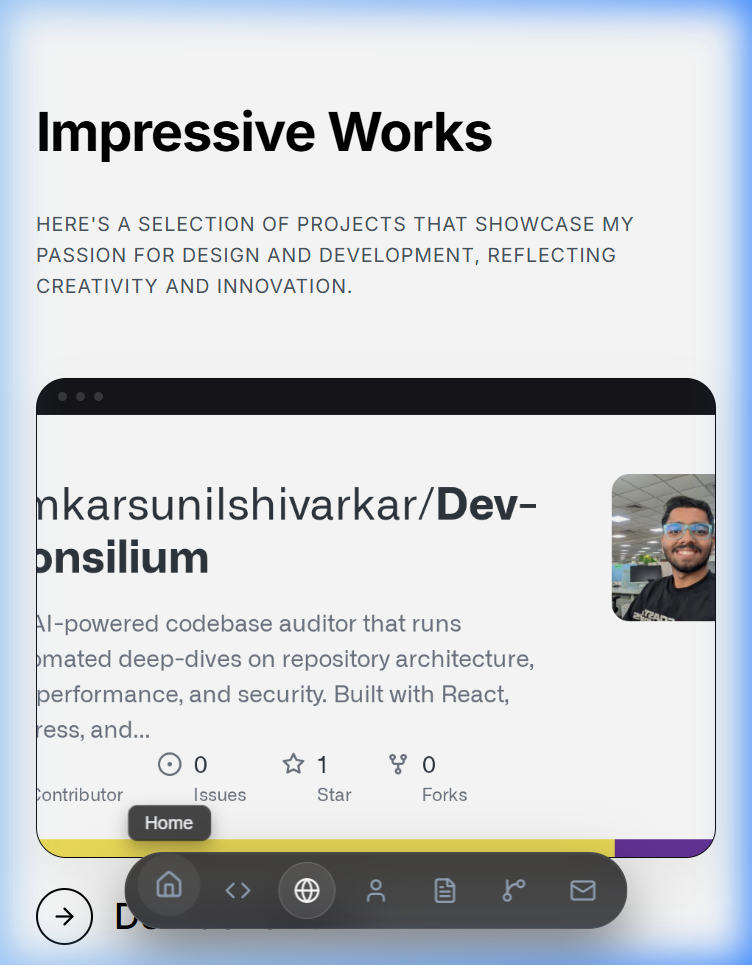
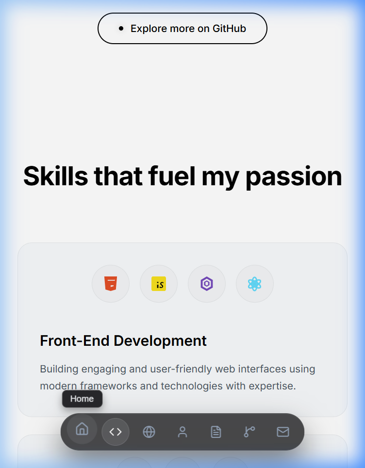
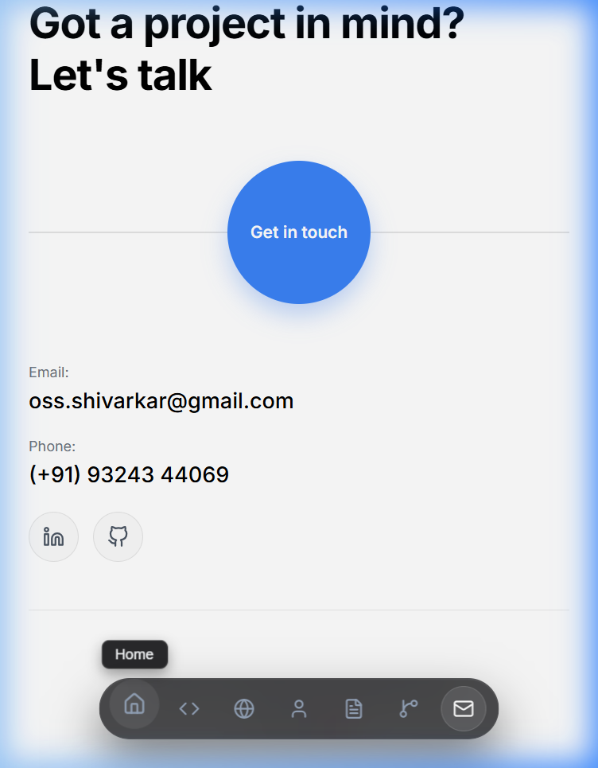

# Omkar Shivarkar | Personal Portfolio

A premium, highly interactive personal portfolio website designed to showcase frontend software engineering projects, technical skills, and background details. Built with a performance-first mindset using clean vanilla architecture.

🌐 **Live Demo:** [omkarshivarkar.vercel.app](https://omkarshivarkar.vercel.app/)

---

## 📸 Screenshots

### Desktop View (Hero Section)


### Mobile Views (Responsive Layouts)

| Hero Section | Projects Grid | Skills Bento | Contact Footer |
| :---: | :---: | :---: | :---: |
|  |  |  |  |

---

## 🚀 Key Features

### 1. Dynamic GitHub Integration & Caching
*   **Live Repositories Fetching**: Automatically pulls your latest projects directly from the GitHub REST API.
*   **Star Filtering**: Configured to dynamically load and display only repositories that have been **starred** by users (`stargazers_count > 0`), highlighting your most popular works.
*   **Fail-safe Cache**: Implements `localStorage` caching with a 1-hour expiration window to prevent API rate limits.
*   **Self-healing Mockups**: If a repository lacks a preview card image, the card dynamically switches to a custom, high-fidelity CSS layout (dashboard grids, AI sandboxes, chat windows) matching the repo context.
*   **Split-Action Buttons**: Hovering over project cards reveals separate **Code** and **Live Demo** buttons, dynamically mapping repository `homepage` properties.

### 2. macOS-Style Interactive Magnetic Dock
*   **Elastic Micro-Animations**: Hovering over the bottom floating navigation bar triggers a custom scale expansion (`scale(1.35)`) on the active icon and spreads smoothly to neighboring icons (`scale(1.15)`), replicating macOS dock physics.
*   **Active Section Tracking**: Employs an `IntersectionObserver` that tracks the scroll position and outlines the active page icon in real-time.
*   **Responsive Ordering**: Synced in the exact scroll flow of the page elements.

### 3. Custom Bento Grid Skills Grid
*   **Alternating Grid Spans**: Arranges your core development areas into a beautiful 4-column Bento grid with custom normal (`span 1`) and wide (`span 2`) card templates.
*   **Animated Tooltips**: Tech stack SVG badges scale up on hover and trigger custom dark floating tooltip labels (e.g., "React", "Material UI", "Turso") for high visual clarity.

### 4. Interactive Spacings & Spans
*   **Consistent Rhythm**: Standardized all section padding to exactly `80px` top and bottom, creating a uniform visual flow.
*   **One-Click Copy Utility**: Clicking the copy icon next to the email address copies it to the clipboard and triggers a floating **"Copied! 🎉"** checkmark bubble, avoiding annoying native email client pop-ups.
*   **Typography System**: Clean font tokens mapping Google's **Inter** typeface globally.

---

## 🛠️ Tech Stack

*   **Framework**: [React](https://react.dev/) (JS / ES6 Modules)
*   **Build Tool**: [Vite](https://vite.dev/) (Fast Hot Module Replacement)
*   **Styling**: Pure CSS3 (Component-separated modular stylesheets)
*   **Icons**: [Lucide React](https://lucide.dev/)

---

## 💻 Local Development Setup

To clone and run the portfolio website on your local machine, follow these steps:

### Prerequisites
Make sure you have [Node.js](https://nodejs.org/) installed (v18+ recommended).

### Installation
1. Clone this repository:
   ```bash
   git clone https://github.com/omkarsunilshivarkar/Portfolio.git
   cd Portfolio
   ```
2. Install dependencies:
   ```bash
   npm install
   ```
3. Start the local development server:
   ```bash
   npm run dev
   ```
   Open `http://localhost:5173/` in your browser to view the site.

### Production Build
To bundle the project into optimized static assets for hosting (Vercel, Netlify, Github Pages):
```bash
npm run build
```
The compiled build output will be stored inside the `dist/` directory.

---

## 📄 License
Created by Omkar Shivarkar. Made with ❤️
